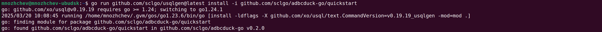
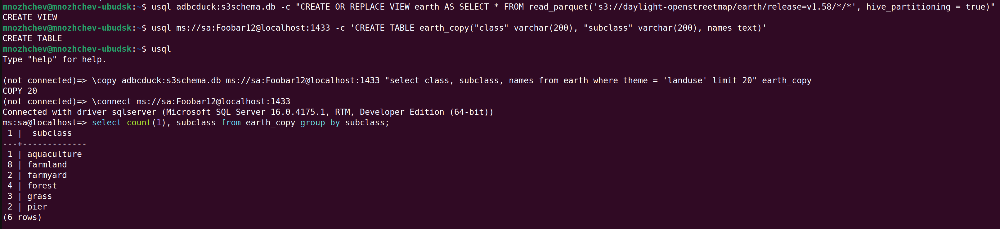

# CLI example

(See [top README](../README.md) for context)

For example, let's use DuckDB to read Parquet files on S3 and copy the results into Microsoft SQL Server (MSSQL):

First, install `usql` with `adbcduck` driver and prepare the MSSQL and DuckDB schemas.
We use [usqlgen](https://github.com/sclgo/usqlgen) to add `adbcduck-go` to `usql`.

In the example, we use MSSQL running on localhost with `sa` password `Foobar12` .
The Parquet data in the example is the open [Daylight Earth dataset](https://daylightmap.org/earth/) from OpenStreetMap.

```shell
# install usql with added adbcduck-go driver that automatically downloads latest DuckDB
go run github.com/sclgo/usqlgen@latest install -i github.com/sclgo/adbcduck-go/quickstart

usql adbcduck:s3schema.db -c "CREATE OR REPLACE VIEW earth AS SELECT * FROM read_parquet('s3://daylight-openstreetmap/earth/release=v1.58/*/*', hive_partitioning = true)"
usql ms://sa:Foobar12@localhost:1433 -c 'CREATE TABLE earth_copy("class" varchar(200), "subclass" varchar(200), names text)'
```

Then start `usql` and copy the data

```shell
usql
# the following commands go on the usql interactive prompt:

# copy data
\copy adbcduck:s3schema.db ms://sa:Foobar12@localhost:1433 "select class, subclass, names from earth where theme = 'landuse' limit 20" earth_copy

# review some copied data
\connect ms://sa:Foobar12@localhost:1433
select count(1), subclass from earth_copy group by subclass;
```

You should see something like:




